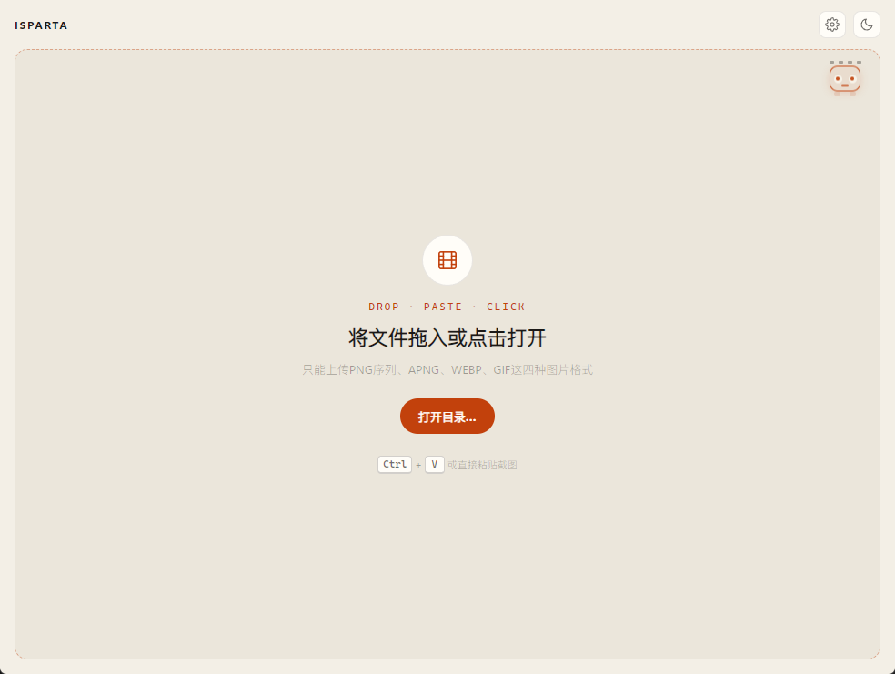
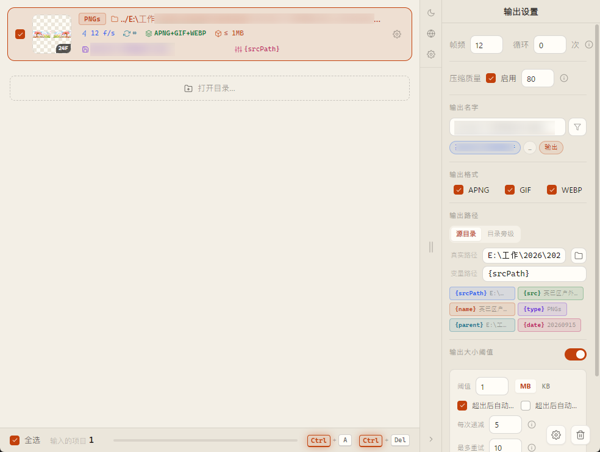
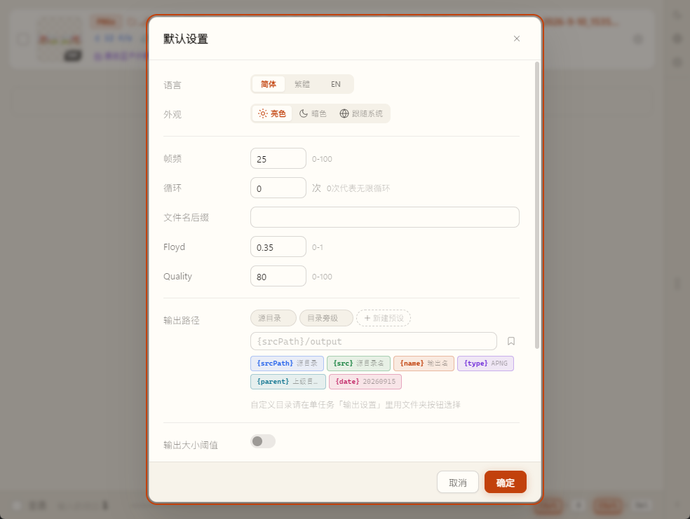

# iSparta-next

**English** | [中文](README.md)

[](https://github.com/yancongya/iSparta-next/releases/latest)
[](https://github.com/yancongya/iSparta-next/releases)
[](https://github.com/yancongya/iSparta-next/actions/workflows/build.yml)
[](https://www.electronjs.org/)
[](https://vuejs.org/)

**iSparta-next** is a desktop animated-image converter rebuilt from the classic [iSparta](https://github.com/iSparta/iSparta). It converts and compresses **APNG / Animated WebP / GIF / PNG sequences**.

> **[Download from Releases →](https://github.com/yancongya/iSparta-next/releases)**  
> Product page: **[https://yancongya.github.io/iSparta-next/](https://yancongya.github.io/iSparta-next/)**  
> Stack: Electron 28 + Vue 2 · Platforms: Windows / macOS / Linux

### Good for

- **APNG to GIF / APNG to WebP**, and reverse **GIF/WebP to APNG**
- **PNG sequence to animated image** (stickers, frame animation)
- **Animated image compression** under a size cap (e.g. 1MB sticker limits)
- **Batch convert** folders of frames with path templates
- Looking for an **iSparta alternative** after the original stalled

## Why iSparta-next

**The original [iSparta](https://github.com/iSparta/iSparta) has been unmaintained for years** — outdated Electron, stagnant UI and pipeline, many unfixed issues (frame order, open-folder failures, storage glitches, broken packaging), and missing security patches.

This repo is **not a small patch**. It is a **full frontend/backend refactor** on top of a community fork (mainly [bigxixi/iSparta](https://github.com/bigxixi/iSparta), which already brought libwebp security upgrades, Electron 6→13, and CI). Codename: **iSparta-next**.

- **Runtime**: Electron 13 → 28; no `remote`; `contextIsolation` / `sandbox`; FS & process work moved toward main-process IPC
- **UI**: Element UI replaced with a custom design system and a two-column workspace (theme, motion, compare, etc.)
- **New features**: output size limit, path templates, paste import, before/after slider — none of which existed in the original
- **Engineering**: GitHub Actions multi-platform builds, unsigned Windows local packaging, archived specs and roadmap

### Lineage

| Source | Status | Main changes vs original | Relation |
| --- | --- | --- | --- |
| [iSparta/iSparta](https://github.com/iSparta/iSparta) (original) | **Abandoned** | Classic APNG/WebP tool; many bugs unfixed | Product origin, **not recommended** |
| [Xheldon/iSparta](https://github.com/Xheldon/iSparta) | Community | Frame-order fixes; partial UI repairs | Historical reference |
| [bigxixi/iSparta](https://github.com/bigxixi/iSparta) | Community fork | libwebp 1.5 (CVE-2023-4863), Electron 6→13, Vue CLI 4, `execFile` hardening, storage/lock fixes, GitHub Actions | **Direct upstream** |
| **This repo (iSparta-next)** | **Current** | See “What was fixed / added” below | Refactor + feature work on bigxixi base; packages on [Releases](https://github.com/yancongya/iSparta-next/releases) |

### What was fixed vs the old app

| Area | Old problem | iSparta-next |
| --- | --- | --- |
| Security | `electron.remote`; renderer Node access; command injection risk | IPC + preload whitelist; `contextIsolation` / `sandbox` / `nodeIntegration:false`; controlled `execFile` |
| Runtime | Stale Electron major | **Electron 28.3.3** |
| Dependency CVEs | Old libwebp (e.g. CVE-2023-4863) | Upstream **libwebp 1.5** binaries |
| Frame order | Occasional scrambled frames on import/open folder | Natural sort on open-folder and drag paths; same-tree APNG dedupe |
| Windows paths | Broken “open original folder” separators | Fixed |
| Storage / state | Empty cache, conversion deadlock, shared `options` refs | Main-process storage; lock/cache hardening; isolated import instances |
| Naming | Forced `_apng` suffix; awkward output paths | Empty default suffix; first preset writes to source dir (no forced `/output`) |
| Packaging | Dead Travis/AppVeyor; unsigned Windows pain | GitHub Actions; local `electronDist` + skip signing; `build:windows` works |

### What was added

1. **Output size limit** — default 1MB; warn / auto-delete / stepwise quality re-encode  
2. **Output path strategy + templates** — source / beside / custom; `{srcPath}` `{srcName}` `{srcParent}` etc.  
3. **Before/after compare slider** — click a done thumbnail, drag or arrow-key to compare  
4. **Paste import** — drag, open folder, or paste a screenshot  
5. **Light / dark theme** — including “follow system”  
6. **Custom UI workspace** — two columns, 1:1 covers, hover preview, collapsible panel, progress, batch stats  
7. **Motion** — entrance, number tween, confetti, drop feedback; respects `prefers-reduced-motion`  
8. **Per-frame delay** — PNG sequences can set delay per frame  
9. **Global defaults** — formats, quality, suffix, size limit presets  
10. **Batch workflow** — multi-select, batch start, unified output dir, success/fail stats  
11. **Runtime log panel** — open from the toolbar; filter by level (all / info / ok / warn / error) with auto-follow, useful for debugging convert failures and path issues  

Details: [`docs/compose/ROADMAP-isparta-next.md`](docs/compose/ROADMAP-isparta-next.md) and `docs/compose/spec/`.

## Screenshots

| Empty state (drop / paste / open) | Main workspace (tasks + output settings) |
| :---: | :---: |
|  |  |

| Default settings |
| :---: |
|  |

## Download

Get the latest installers from **[Releases](https://github.com/yancongya/iSparta-next/releases)**.

| Platform | Artifact | Arch |
| --- | --- | --- |
| Windows | `.zip` | x64 |
| macOS | `.zip` (contains `.app`) | x64 / arm64 |
| Linux | `.tar.gz` | x64 |

All three platforms are built by GitHub Actions. **macOS packages are unsigned** — unzip and, if Gatekeeper blocks the app, allow it in System Settings → Privacy & Security, or run `xattr -dr com.apple.quarantine` on the `.app`.

## Features

### Format conversion

| Input | Output | Notes |
| --- | --- | --- |
| PNG sequence | APNG | FPS / loop; per-frame delay |
| GIF | APNG | Lossless or quality-controlled |
| WebP | APNG | Animated WebP → APNG |
| APNG | Animated WebP | Loop, lossless, quality |
| APNG | GIF | APNG → GIF |
| APNG | APNG | Lossless / lossy compress |

### Workflow

- **Batch** — many tasks, per-task options, batch start, shared output dir  
- **Drag & paste** — files/folders or pasted screenshots  
- **Path templates** — source / beside / custom with variables  
- **Size limit** — default 1MB, warn / delete / auto re-encode  
- **Compare slider** — original vs output  
- **Themes** — light, dark, system  
- **i18n** — 简体中文, 繁體中文, English  
- **Global defaults** — formats, quality, suffix, limits  

## Requirements

- [Node.js](https://nodejs.org/) (16+ recommended, matches CI)
- npm
- Linux extra dep for some native binaries:

```bash
sudo apt-get install libpng16-dev
```

## Quick start

```bash
git clone https://github.com/yancongya/iSparta-next.git
cd iSparta-next
npm install
npm run dev
```

## Build

```bash
# mac + win + linux
npm run build

# Windows only
npm run build:windows
```

Outputs land in `dist_electron/`.

### Packaging notes

- `electron-builder` config: [`electron-builder.yml`](electron-builder.yml)
- Prefers local Electron (`electronDist`) to avoid re-download
- Windows skips code signing by default (`signAndEditExecutable: false`)
- App ID: `io.github.isparta`

### CI & release

| Workflow | File | Trigger | What it does |
| --- | --- | --- | --- |
| **Build Multi-Platform** | [build.yml](.github/workflows/build.yml) | push `master` / manual | Builds Win/Linux/macOS artifacts (~7 days), **no Release** |
| **Release** | [release.yml](.github/workflows/release.yml) | manual `workflow_dispatch` | Bump version → commit + tag → auto changelog → build 3 OS → GitHub Release |

#### Daily builds

Push to `master` builds test packages. Or run **Build Multi-Platform** from the Actions tab.

#### Cutting a release (use Actions)

1. **Actions → Release → Run workflow**
2. Choose:
   - **bump**: `patch` / `minor` / `major` (from current `package.json`)
   - **prerelease**: mark as Pre-release on GitHub
   - **dry_run**: compute + build only; no commit/tag/Release
3. On success it:
   - Updates `package.json` / `package-lock.json`
   - Commits `chore(release): vX.Y.Z [skip ci]` and tags `vX.Y.Z`
   - Builds Win/Linux and attaches them to the GitHub Release

> macOS is not built in CI; build locally and attach the dmg.  
> If `master` blocks bot pushes, temporarily allow it or wire a PAT.  
> Do not rely on hand-pushed `v*` tags — **only the Release workflow publishes**.

Checklist: [`docs/RELEASE.md`](docs/RELEASE.md).

## Project structure

```text
iSparta-next/
├── src/
│   ├── background.js          # Electron main (window, IPC, menu, file protocol)
│   ├── preload.js             # contextBridge API
│   ├── main.js / App.vue      # Renderer entry
│   ├── ui-next/               # New UI (design system, theme, Home)
│   ├── components/            # Business UI (list, settings, compare, delay…)
│   ├── util/processor/        # Converters + size gate
│   ├── store/                 # Vuex
│   ├── locales/               # i18n
│   └── router.js
├── static/bin/                # Native binaries (win32 / win64 / mac)
├── public/                    # Assets, icons, screenshots
├── test/                      # Sample PNG / GIF / APNG / WebP
├── docs/                      # Roadmap & specs
├── electron-builder.yml
└── vue.config.js
```

## Scripts

| Command | Purpose |
| --- | --- |
| `npm run dev` | Dev app |
| `npm run build` | Build mac + win + linux |
| `npm run build:windows` | Windows only |
| `npm run lint` | ESLint / Vue |

## Tech stack

- **Desktop**: [Electron](https://www.electronjs.org/) 28  
- **UI**: Vue 2 · Vue Router · Vuex · vue-i18n · Sass  
- **Tooling**: Vue CLI 4 · vue-cli-plugin-electron-builder · electron-builder  
- **Engines**: APNG Tools (`apngasm` / `apngdis` / `apngopt` / `apngquant`), libwebp (`cwebp` / `dwebp` / `webpmux`), `gif2apng` / `apng2gif`  

## Security architecture

- No `remote`; dialogs/menus via main-process IPC  
- `contextIsolation: true` · `nodeIntegration: false` · `sandbox: true`  
- Preload whitelist; FS and `execFile` prefer main process  
- Renderer loads local frame thumbs via `isparta-file` protocol  

Roadmap: [`docs/compose/ROADMAP-isparta-next.md`](docs/compose/ROADMAP-isparta-next.md).

## Languages

UI language in settings:

- 简体中文  
- 繁體中文  
- English  

## Contributing

Issues and PRs welcome.

1. Fork and branch  
2. `npm install && npm run dev`  
3. Keep `npm run lint` green  
4. Describe motivation and how you verified  

## Credits

### Current maintainer (iSparta-next)

- [yancongya](https://github.com/yancongya) — this repo (refactor, features, releases)

### Original authors

- [jeakey](https://github.com/jeakey)  
- [ccJUN](https://github.com/ccJUN)  
- [yikfun](https://github.com/yikfun)  

### Historical contributors / upstream forks

- [DreamPiggy](https://github.com/dreampiggy)  
- [Xheldon](https://github.com/Xheldon)  
- [bigxixi](https://github.com/bigxixi)  

Thanks to everyone who contributed to iSparta and its community forks.

### Third-party tools

- [apngasm](http://apngasm.sourceforge.net/)  
- [APNG Optimizer](https://sourceforge.net/projects/apng/files/APNG_Optimizer/)  
- [apng2webp](https://github.com/Benny-/apng2webp)  
- [pngout](http://advsys.net/ken/utils.htm)  
- [pngquant](https://pngquant.org/)  
- [libwebp](https://developers.google.com/speed/webp/)  

## License

See the license file in this repository; historically the project follows the original iSparta open-source license.
